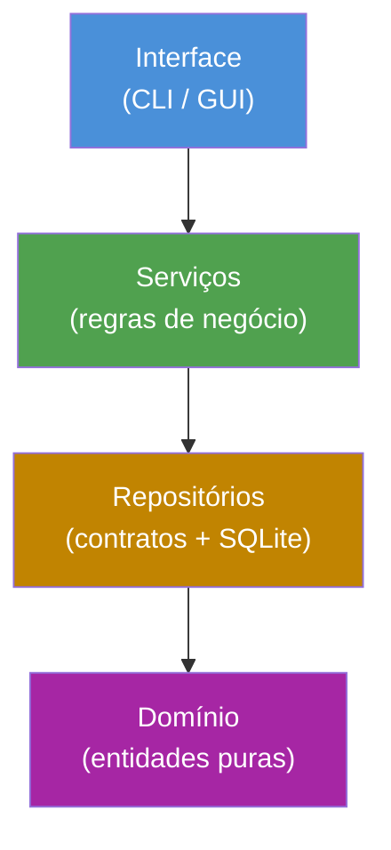

# BackOffice B2B System

Sistema de gestão comercial B2B (ERP simples) para empresas que ainda dependem de planilhas — cadastro de clientes e produtos, tabelas de preço nomeadas, orçamentos, propostas comerciais e pedidos de venda.


## Sobre o projeto

Este é um sistema BackOffice B2B construído com foco em **arquitetura de software sólida**: Clean Architecture, princípios SOLID e Repository Pattern aplicados desde a primeira linha de código. O projeto tem um propósito duplo — ser uma ferramenta funcional de verdade e, ao mesmo tempo, uma peça de portfólio demonstrando decisões de design conscientes, não apenas código que funciona.

## Arquitetura

O projeto segue Clean Architecture em camadas, com dependências apontando sempre para dentro (a camada de domínio nunca depende de nada externo):



**Decisões de design aplicadas:**
- **Repository Pattern** com contratos abstratos (`ABC`), permitindo trocar a implementação de persistência sem tocar na camada de serviço
- **Injeção de Dependência** via construtor em toda a camada de serviço — nenhum serviço cria suas próprias dependências
- **Aggregate Root**: `TabelaPreco` gerencia seus próprios `ItemTabelaPreco`, garantindo consistência transacional
- **Soft delete** em todas as entidades com relevância histórica (campo `ativo`), nunca exclusão física
- **Decimal em vez de float** para todo valor monetário, evitando erros de arredondamento em ponto flutuante
- **Testes com repositórios fake em memória** para a camada de serviço (isolados, rápidos, sem tocar banco real) e **testes de integração** reais contra SQLite para a camada de persistência


**Decisões de design aplicadas:**
- **Repository Pattern** com contratos abstratos (`ABC`), permitindo trocar a implementação de persistência sem tocar na camada de serviço
- **Injeção de Dependência** via construtor em toda a camada de serviço — nenhum serviço cria suas próprias dependências
- **Aggregate Root**: `TabelaPreco` gerencia seus próprios `ItemTabelaPreco`, garantindo consistência transacional
- **Soft delete** em todas as entidades com relevância histórica (campo `ativo`), nunca exclusão física
- **Decimal em vez de float** para todo valor monetário, evitando erros de arredondamento em ponto flutuante
- **Testes com repositórios fake em memória** para a camada de serviço (isolados, rápidos, sem tocar banco real) e **testes de integração** reais contra SQLite para a camada de persistência

## Tecnologias

- **Python 3.14**
- **SQLite** — persistência
- **pytest** — testes automatizados
- **PySide6** — interface gráfica desktop *(planejado)*

## Estrutura de pastas

```
backoffice_b2b_system/
├── src/
│   ├── dominio/            # Entidades puras: Cliente, Produto, Servico, TabelaPreco
│   │   ├── entidades/
│   │   ├── validadores.py  # Validação de CPF/CNPJ
│   │   └── formatadores.py # Formatação de moeda (padrão brasileiro)
│   ├── servicos/           # Regras de negócio, com DI via construtor
│   ├── repositorios/
│   │   ├── contratos/      # Interfaces abstratas (ABC)
│   │   └── sqlite/         # Implementação concreta com SQLite
│   ├── infraestrutura/     # Conexão com banco e schema
│   └── interface/
│       ├── cli/            # Interface de linha de comando
│       └── gui/            # PySide6 (planejado)
├── testes/
│   ├── unitarios/          # Testes de entidades e serviços (com fakes em memória)
│   ├── integracao/         # Testes de repositórios contra SQLite real
│   └── fakes/              # Repositórios fake para testes de serviço
└── main.py
```

## Como rodar

```powershell
# Clonar o repositório
git clone https://github.com/jmmj-dev/backoffice_b2b_system.git
cd backoffice_b2b_system

# Criar e ativar o ambiente virtual
python -m venv .venv
.venv\Scripts\activate

# Instalar dependências
pip install -r requirements.txt

# Configurar variáveis de ambiente
copy .env.example .env

# Rodar
python main.py
```

## Testes

```powershell
python -m pytest testes\ -v
```

O projeto conta atualmente com **91 testes automatizados**, cobrindo:
- Validações de entidade (CPF/CNPJ, regras de negócio intrínsecas)
- Regras de serviço (duplicidade de documento, validação cruzada entre agregados)
- Persistência real contra SQLite (incluindo comportamento de agregado)

## Roadmap

- [x] Estrutura do projeto e ambiente
- [x] Entidades de domínio (Cliente, Produto, Serviço, TabelaPreco)
- [x] Repositórios (contrato + SQLite) para todas as entidades
- [x] Camada de serviços com regras de negócio
- [ ] CLI básica
- [ ] Orçamentos
- [ ] Propostas comerciais + fluxo de aprovação
- [ ] Pedidos de venda + histórico de negociações
- [ ] CI (GitHub Actions)
- [ ] Interface gráfica desktop (PySide6)

## Licença

Este projeto está sob a licença MIT — veja o arquivo [LICENSE](LICENSE) para mais detalhes.